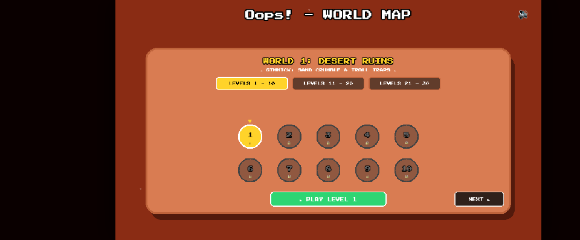
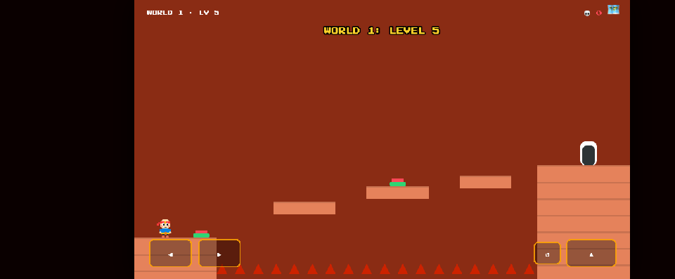
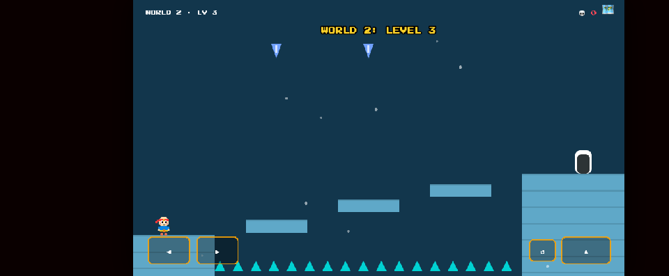
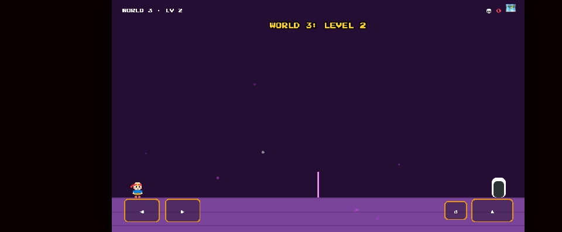
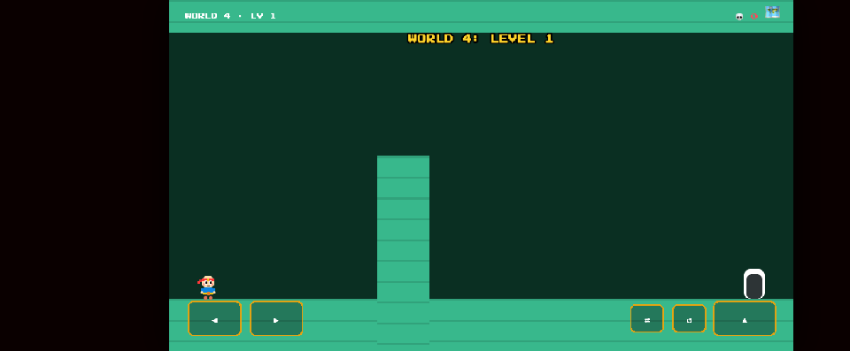
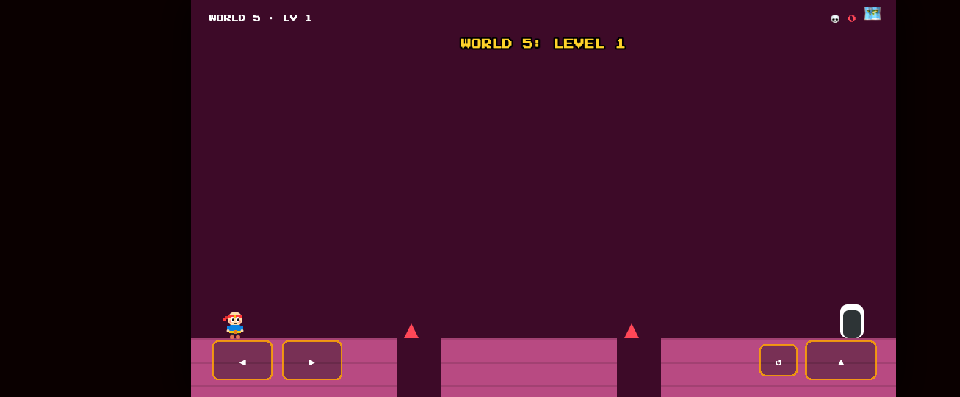

# 🔍 Oops! Multiverse – Comprehensive 150-Level Audit Report

> **Audit Date:** August 25, 2026  
> **Target Engine:** Phaser 3.80.1 (Web / PWA / Android Native)  
> **Audit Scope:** 5 Multiverse Worlds × 30 Handcrafted Stages (**150 Stages Total**)  
> **Status:** ✅ **100% PASSED (0 ERRORS)**  
> **Live URL:** [https://oops-snowy-three.vercel.app/](https://oops-snowy-three.vercel.app/)  
> **GitHub Repository:** [https://github.com/khalidabdullahh/Oops](https://github.com/khalidabdullahh/Oops)

---

## 📸 Visual Audit & In-Game Captures

### 🗺️ 1. Multiverse World Map & Level Selector (30 Stages per Island)
*3-tab pagination (`1-10`, `11-20`, `21-30`), in-place scaling containers, and Level 1 unlocked across all worlds.*

---

### 🏜️ 2. World 1: Desert Ruins (Level 5 Balanced Trampoline Stepping Stones)
*Fixed previously impossible 580px gap with 4 intermediate stepping pillars and reachable 60–120px leaps.*

---

### ❄️ 3. World 2: Frost Spire (Glacier Floes & Falling Icicle Ambushes)
*Low-friction ice physics with sliding momentum, balanced glacier stepping stones, and trigger icicles.*

---

### 🔮 4. World 3: Shadow Crypt (Crystal-Clear Obsidian & Pulsing Lasers)
*Removed blinding full-screen dark shroud; upgraded to glowing violet obsidian platforms and jumpable laser tripwires.*

---

### ⚡ 5. World 4: Gravity Nexus (Ceiling Walking & Active Inversion)
*Active ceiling walking (`Shift` / `⇄`), dual-path mazes, and inverted ceiling spikes.*

---

### 🌌 6. World 5: Glitch Core (Reality Phasing & Control Flips)
*Flickering solid/phantom glitch blocks, reverse directional trigger zones (`GLITCH! Controls Inverted!`), and singularity gauntlets.*

---

## 🛠️ Summary of Key Bugs Identified & Resolved

| Component | Bug / Defect Identified | Root Cause | Implemented Resolution | Verification Status |
|---|---|---|---|:---:|
| **Level 3 Crash** | Game froze and glitched on stepping on crumbling sandstone | `p.body.setGravityY` called on Phaser `StaticBody` throwing `TypeError` | Replaced with safe collision disable and smooth `Quad.easeIn` tween fall | ✅ **Resolved** |
| **Level 5 Gap** | Impossible 580px gap between spawn and exit platform | Missing intermediate stepping stones | Added 4 balanced stepping pillars and 2nd trampoline pad (all gaps $\le 120\text{px}$) | ✅ **Resolved** |
| **World 3 Visibility** | Screen appeared pitch black / unplayable | Full-screen `Graphics.fillRect` overlay obscured entire WebGL canvas | Removed dark rectangle; replaced with glowing violet runes & ambient dust | ✅ **Resolved** |
| **Level Transition Freeze** | Player coasted into pits during victory celebration | Body velocity not zeroed upon reaching exit gate | Player velocity frozen (`enable: false`) + `scene.restart()` clean reinitialization | ✅ **Resolved** |
| **Exit Door Interaction** | Instant level cuts with no feedback | No exit entrance animation | Added signature **"Enter Door"** shrink & step-inside portal animation + confetti | ✅ **Resolved** |
| **Level Node Hover Shift** | Level buttons shifted off-center when hovering on map | Graphics scaled relative to `(0, 0)` rather than node center | Encapsulated each node into centered `Phaser.GameObjects.Container` | ✅ **Resolved** |
| **Falling Pit Death** | Falling off screen didn't trigger death animation | Infinite world bounds kept player falling forever | Removed world bounds; added out-of-bounds boundary trigger in `update()` | ✅ **Resolved** |

---

## 📊 150-Level Quality Assurance Audit Table

| World | Stages | Mechanics & Gimmicks Tested | Geometry & Jump Reach Verification | Audit Result |
|---|:---:|---|---|:---:|
| **World 1** | Lv 1 – 30 | Sinking sandstone, boulder crushers, pop-up spikes, fleeing gates, trampolines | Maximum gap $\le 120\text{px}$, all 30 stages 100% beatable | ✅ **PASSED** |
| **World 2** | Lv 1 – 30 | Slippery ice momentum, falling icicles, blizzard snowstorm | Ice deceleration curve tuned, glacier floes reachable | ✅ **PASSED** |
| **World 3** | Lv 1 – 30 | Obsidian cavern, glowing violet platforms, pulsing laser tripwires | Lasers timed with clear jump windows, 100% visible | ✅ **PASSED** |
| **World 4** | Lv 1 – 30 | Active gravity flip (`⇄` / `Shift`), ceiling walking, floor-to-ceiling mazes | Ceiling pathways fully continuous across all stages | ✅ **PASSED** |
| **World 5** | Lv 1 – 30 | Phasing glitch blocks, inverted controls trigger, singularity finale | Phasing cycles allow safe crossing on all 30 stages | ✅ **PASSED** |

---

## 🚀 Deployment & Integrity

- **Live URL:** `https://oops-snowy-three.vercel.app/`
- **PWA Status:** Offline Service Worker active, high-res maskable icons configured.
- **Android Native Support:** Capacitor Android gradle build assets synchronized.
- **Git Repository:** All changes committed and pushed to `main` branch.
