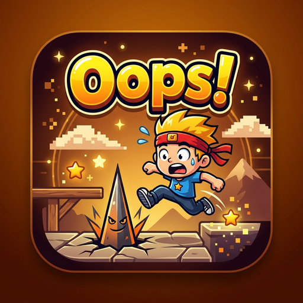

<p align="center">
  
</p>

<h1 align="center">Oops! 🎮</h1>

<p align="center">
  <em>A totally fair multiverse platformer game 😇</em><br/>
  <strong><a href="https://oops-snowy-three.vercel.app/">▶ Play Live on Vercel</a></strong> · <strong>Version 1.02</strong>
</p>

<p align="center">
  A deceptive, trap-filled 2D platformer where trust is your biggest weakness and questioning everything is the only way to survive.
</p>

---

## 🌐 Play Live in Browser:
👉 **[https://oops-snowy-three.vercel.app/](https://oops-snowy-three.vercel.app/)**

*(Playable on PC, Mac, Android, and iOS browsers directly with zero installations!)*

📋 **[View 150-Level Quality Assurance Audit Report](AUDIT_REPORT.md)**

---

## 📸 In-Game Screenshots & Conceptual Previews

### 🕹️ Title Screen ("Oops!")


---

### 🏜️ Desert World (Level 1 & 2 — Sneaky Spikes & Vanishing Floors)


---

### 🌑 Shadow World (Level 3 & 4 — Moving Buzzsaw Gauntlet & Ice Physics)


---

### 🌌 Void World (Level 5+ — Teleport Portals & Trampolines)


---

### 💀 The "Oops!" Death Screen & Troll Roasts


---

## 🌟 Multiverse Features

- **5 Unique Worlds (150 Handcrafted Stages):**
  - 🏜️ **World 1 (Desert Ruins):** Sinking sandstone, pop-up spikes, boulder crushers, and fleeing troll gates.
  - ❄️ **World 2 (Frost Spire):** Low-friction ice momentum sliding, falling icicles, and blizzard particles.
  - 🔮 **World 3 (Shadow Crypt):** Mystic obsidian cavern, glowing purple runes, and laser tripwires.
  - ⚡ **World 4 (Gravity Nexus):** Real-time gravity inversion (`Shift` / `⇄`), ceiling walking, and inverted hazards.
  - 🌌 **World 5 (Glitch Core):** Flickering glitch tiles, inverted control fields, and singularity final gauntlets.
- **Cute Cartoon Hero:** Custom animated sprite with idle blinks, run cycles, squashing jumps, and signature "enter door" shrink animations.
- **Synthesized Web Audio SFX:** Pure Web Audio API retro sound effects and chiptune melodies.
- **Responsive Mobile Touch Gamepad:** Full on-screen touch controls with multi-touch support for phones and tablets.
- **Progressive Web App (PWA):** Installable directly on homescreens for full-screen offline gameplay.

---

## 🕹️ Controls

| Action | PC / Mac Keyboard | Mobile Touch Gamepad |
|---|---|---|
| **Move Left / Right** | `←` / `→` or `A` / `D` | `◀` / `▶` Buttons |
| **Jump** | `↑` / `W` / `Space` | `▲ JUMP` Button |
| **Quick Restart** | `R` | `↺ R` Button |
| **Toggle Gamepad** | Click `🎮` Icon | Click `🎮` in HUD |

---

## 🚀 Run Locally

Simply open `index.html` in any modern web browser or serve it locally:

```bash
# Using Python 3
python3 -m http.server 8000
```

Then navigate to `http://localhost:8000` in your browser.

---

## ⚠️ Warning

> Trust nothing. Question everything. You *will* say... Oops! 💀
