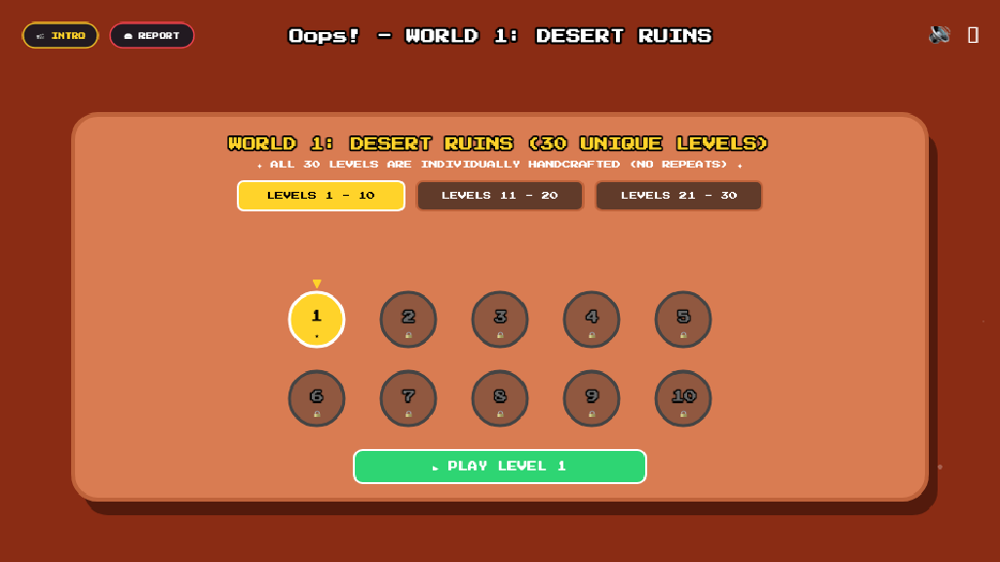
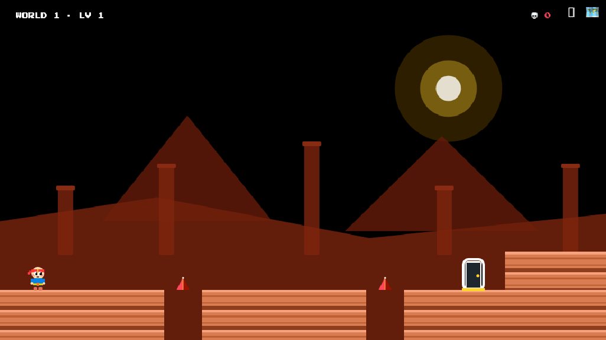
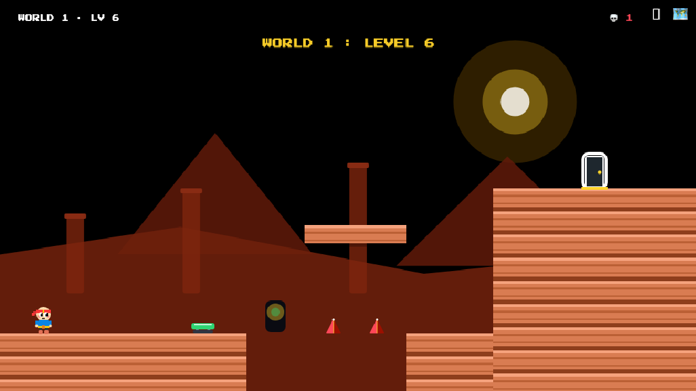
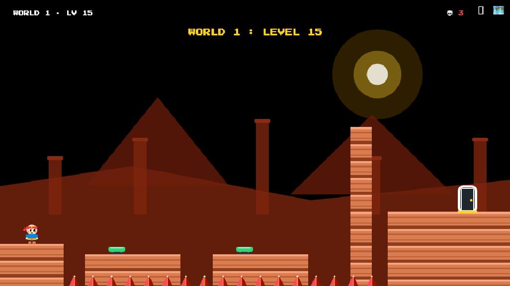
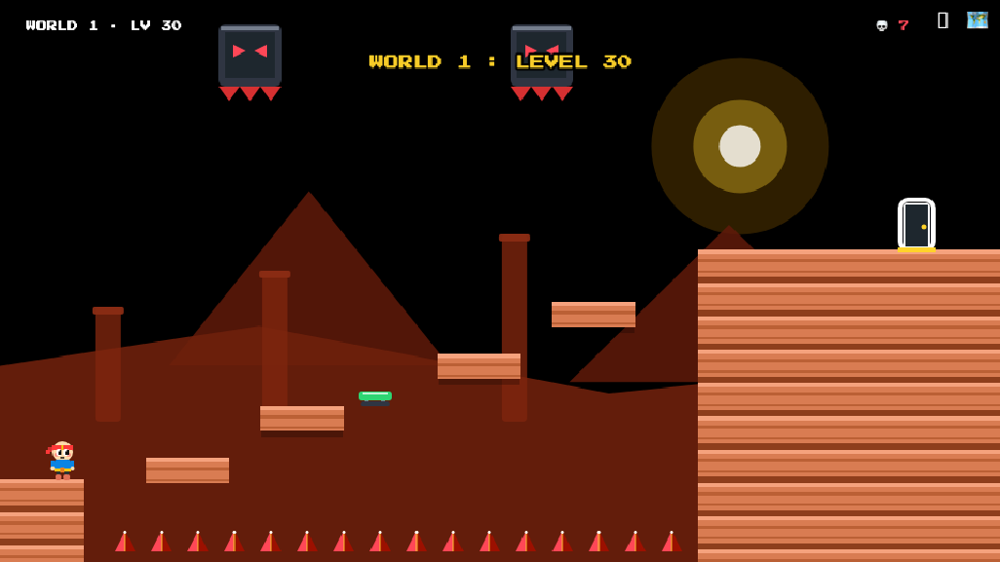
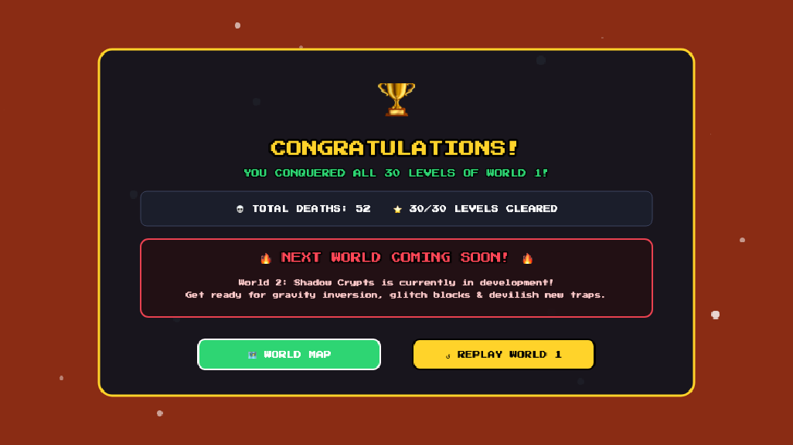
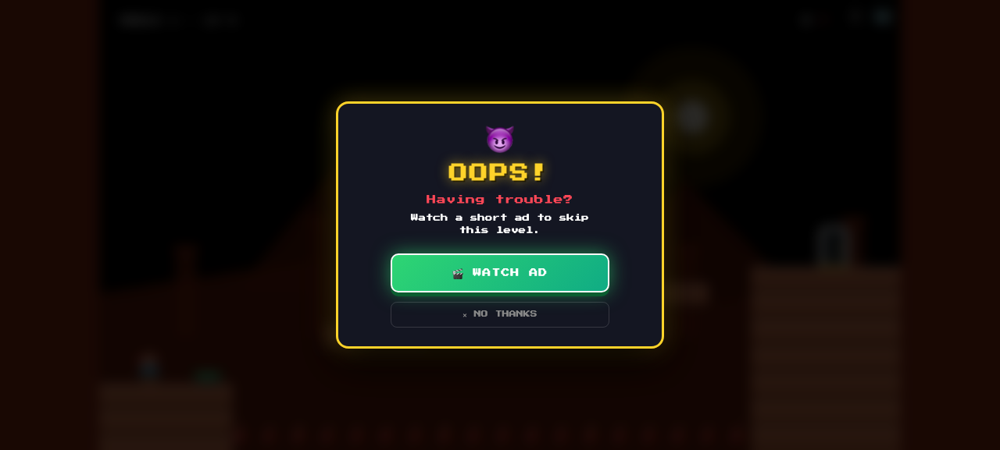
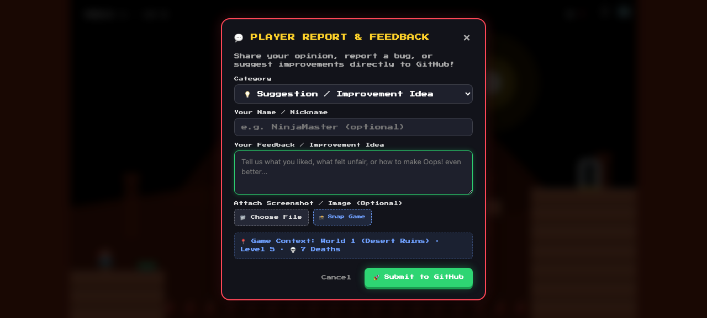
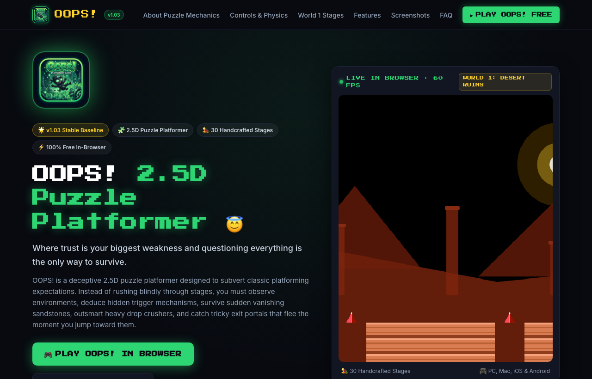
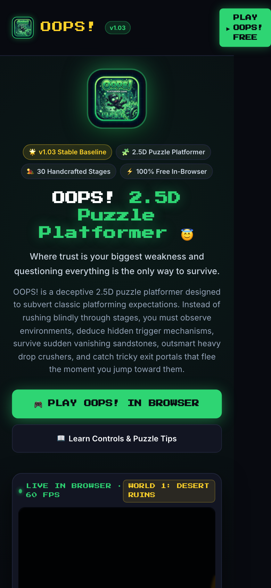

<p align="center">
  
</p>

<h1 align="center">Oops! 🎮</h1>

<p align="center">
  <em>A totally fair multiverse platformer game 😇</em><br/>
  <strong><a href="https://oops-snowy-three.vercel.app/">▶ Play Live on Vercel</a></strong> · <strong>Version 1.03</strong>
</p>

<p align="center">
  A deceptive, trap-filled 2D/2.5D platformer where trust is your biggest weakness and questioning everything is the only way to survive.
</p>

---

## 🌐 Play Live in Browser:
👉 **[https://oops-snowy-three.vercel.app/](https://oops-snowy-three.vercel.app/)**

*(Playable on PC, Mac, Android, and iOS browsers directly with zero installation required!)*

---

## 🛠️ Tech Stack & Engine Architecture

* **Core Engine**: **Phaser 3.80.1** (`phaser.min.js`, Arcade Physics).
* **Rendering & Aesthetics**: **2.5D Stylized Visuals** featuring:
  - Multi-layer real-time parallax desert background (far dunes & mid ruins).
  - Platform tiles with 3D sunlit top highlights and depth bevel extrusions.
  - 3D faceted metallic hazard spikes with lighting glints.
  - Recessed 2.5D steel crushers with glowing eye slits.
  - 3-part depth portal exit doorways and mechanical spring trampolines.
* **Sound System**: Procedural **Web Audio API** synthesizer (zero external audio file latency).
* **Monetization**: Google H5 Games Ads Placement API with 7-death rewarded level-skip flow (`ca-pub-7942277005068512`).
* **Mobile & Responsive**: Touch gamepad overlay with slide clusters, responsive letterboxed canvas (`960x540` virtual resolution), portrait and landscape support.
* **Platform Packaging**: Progressive Web App (PWA) + Android ready via Capacitor 5.

---

## 🗺️ Current Content: World 1 (Desert Ruins)

* **Status**: Stable & Frozen Baseline for **v1.03**.
* **Levels**: **30 Individually Handcrafted Stages** (Levels 1–30, zero auto-generation).
* **Troll Hazards**: Sinking sandstone, surprise pop-up spikes, boulder crushers, spring trampolines, and fleeing exit gates.
* **Climax**: Stage 30 Master Singularity leading to the `WorldCompleteScene` victory screen.
* **Roadmap**: World 2 (Frost Spire) planned for future major release.

---

## 📸 In-Game Screenshots Showcase

| World 1 Map (30 Stages) | Stage 1: Desert Ruins |
|:---:|:---:|
|  |  |

| Stage 6: Crusher Alley | Stage 15: Fleeing Exit Door |
|:---:|:---:|
|  |  |

| Stage 30: Master Singularity | World 1 Victory Celebration |
|:---:|:---:|
|  |  |

| 7-Death Rewarded Ad Offer | In-Game Player Feedback Modal |
|:---:|:---:|
|  |  |

| Official Web Portal (Desktop) | Official Web Portal (Mobile) |
|:---:|:---:|
|  |  |

---

## 🕹️ Controls

| Action | PC / Mac Keyboard | Mobile Touch Gamepad |
|---|---|---|
| **Move Left / Right** | `←` / `→` or `A` / `D` | `◀` / `▶` Buttons (supports touch sliding) |
| **Jump** | `↑` / `W` / `Space` | `▲ JUMP` Button |
| **Quick Restart** | `R` | `↺` / `↺ RESTART` Button |
| **Skip Level (Unlocked)** | Click `📺 SKIP` in HUD | Tap `📺 SKIP` in Portrait Deck |
| **World Map / Levels** | Click `🗺️` Icon | Tap `🗺️ MAP` in Deck |
| **Fullscreen Toggle** | Click `⛶` Icon | Browser default fullscreen |

---

## 🚀 Run Locally

Open `index.html` in any modern web browser or serve it locally with Python 3:

```bash
# Serve locally
python3 -m http.server 8000
```

Then open `http://localhost:8000` in your browser.

---

## 📦 Build & Deploy

* **Web / Vercel**: Static hosting from project root.
* **Android APK (Capacitor)**:
  ```bash
  # 1. Sync web assets to www/
  cp index.html style.css game.js phaser.min.js manifest.json sw.js favicon.* logo.png www/
  cp -r icons www/

  # 2. Sync and open in Android Studio
  npm run cap-sync
  npm run cap-open
  ```

---

## ⚠️ Warning

> Trust nothing. Question everything. You *will* say... Oops! 💀
