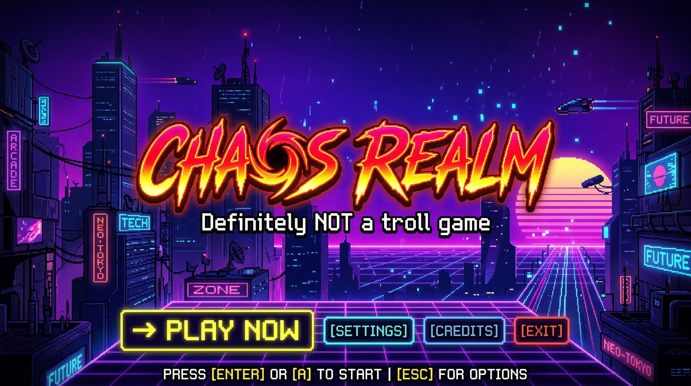
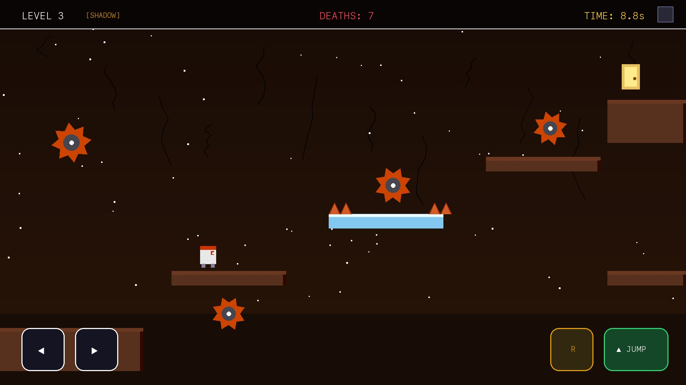
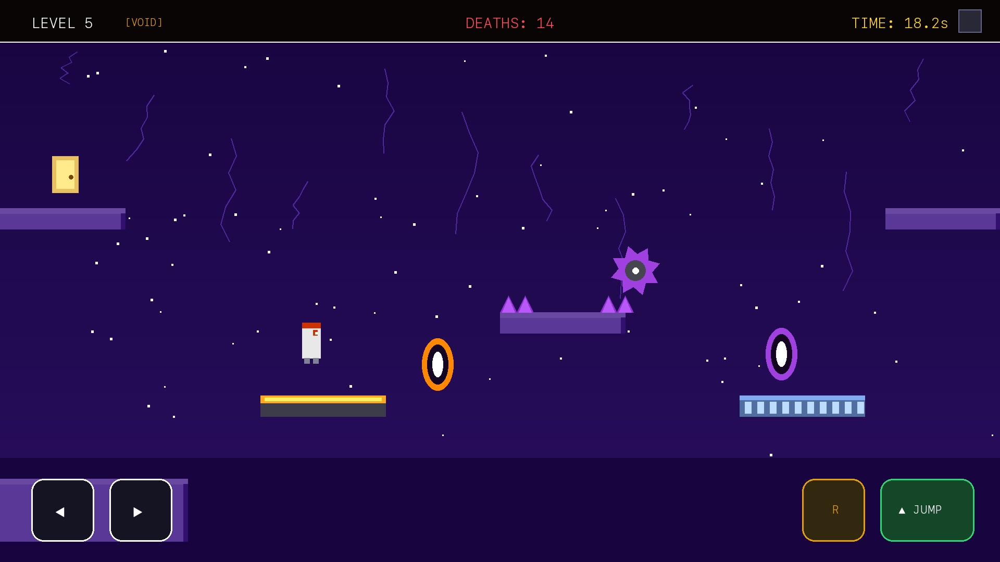
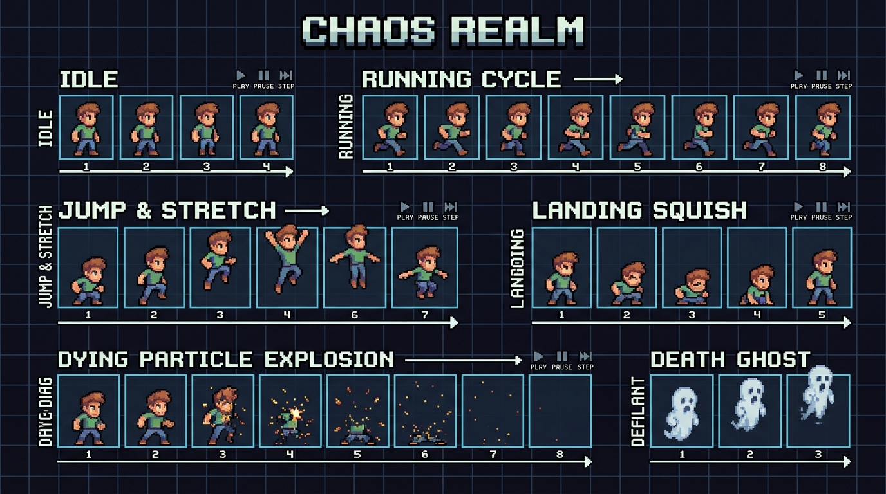

# Oops! 🎮

> *A totally fair game* 😇

A deceptive, trap-filled 2D platformer where trust is your biggest weakness and questioning everything is the only way to survive.

---

## 🌐 Play Live in Browser:
👉 **[https://khalidabdullahh.github.io/Oops/](https://khalidabdullahh.github.io/Oops/)**

*(Playable on PC, Mac, Android, and iOS browsers directly with zero installations!)*

---

## 📸 Screenshots & Previews

### 🕹️ Title Screen


---

### 🏃 Gameplay, Worlds & Deadly Traps


---

### 🌀 Portals, Lasers & Dynamic Mechanics


---

### 💀 Humorous Troll Death Screens


---

### 🎞️ Character Animations & Sprite Showcase


---

## 🌟 Features

- **Level Devil Inspired Troll Design:** Invisible traps, fake platforms, dynamic hazards, and sudden surprises.
- **World Themes:** 3 distinct biomes including `DESERT`, `SHADOW`, and `VOID` with unique color palettes, atmospheric fog, and crack decorations.
- **Synthesized Web Audio SFX:** Pure Web Audio API retro sound effects with no external audio files required.
- **Mobile Touch Gamepad:** Full on-screen touch controls with multi-touch support and haptic feedback.
- **Responsive PWA:** Installable as a progressive web app on phones and tablets.
- **Zero Dependencies:** Built entirely with vanilla JavaScript, HTML5 Canvas, and modern CSS.

---

## 🕹️ Controls

| Action | PC / Mac Keyboard | Mobile Touch Gamepad |
|---|---|---|
| **Move Left / Right** | `←` / `→` or `A` / `D` | `◀` / `▶` Buttons |
| **Jump** | `↑` / `W` / `Space` | `▲ JUMP` Button |
| **Quick Restart** | `R` | `↺ R` Button |
| **Toggle Gamepad** | Click `🎮` Icon | Click `🎮` in HUD |

---

## 🚀 Run Locally

Simply open `index.html` in any modern web browser or serve it locally:

```bash
# Using Python 3
python3 -m http.server 8000
```

Then navigate to `http://localhost:8000` in your browser.

---

## ⚠️ Warning

> Trust nothing. Question everything. You *will* say... Oops! 💀
