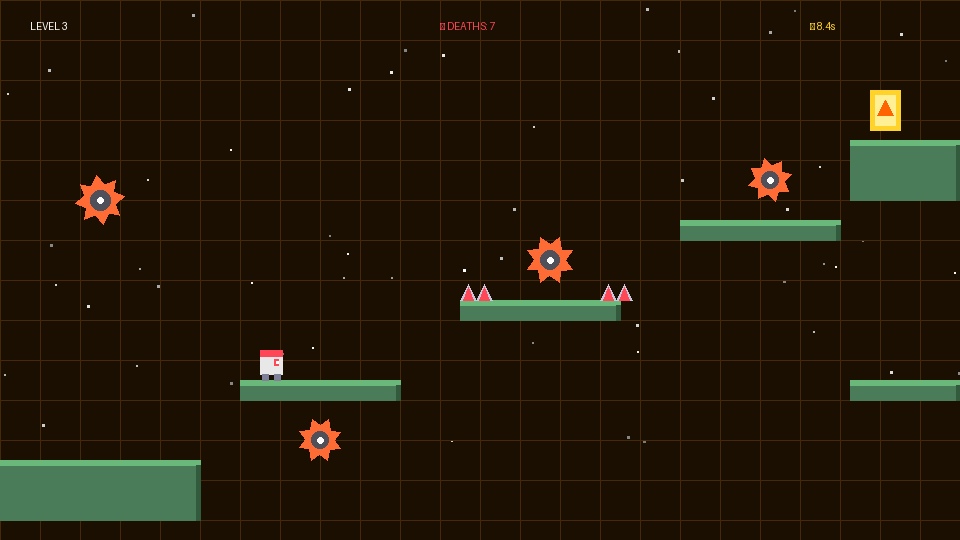
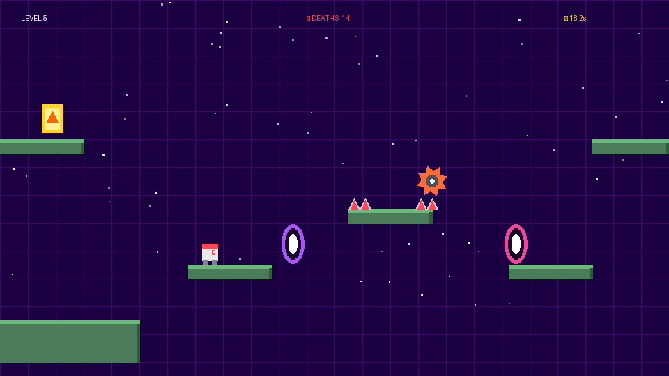
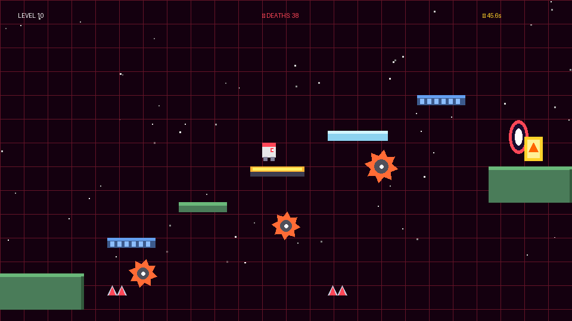

# Task 05: 10 Progressive Levels & Stage Blueprints

## 🎯 Task Objective
Design and script 10 distinct, escalating challenge levels combining all mechanics, troll traps, puzzle paths, and unique background themes.

---

## 🗺️ Level Breakdown & Output Screenshots

### Level 1: Welcome :) (Tutorial Trap)
Introduces jumping, basic platforming, and the first disappearing platform surprise at the goal.


---

### Level 3: Buzzsaw Ballet
Introduces moving circular saws with horizontal & vertical patrol routes and spike rows.


---

### Level 5: Portal Problems
Introduces dual-color teleporter portals where one leads to a spike trap and the other to safety.


---

### Level 10: The Chaos Realm (Final Boss Stage)
Combines all previous mechanics: disappearing blocks, fake tiles, ice physics, trampolines, and fast saws.


---

## 💻 Level Factory Architecture

```javascript
function getLevel(index) {
  switch(index) {
    case 0: return level_tutorial();
    case 1: return level_vanishing();
    case 2: return level_saws();
    case 3: return level_iceAge();
    case 4: return level_portalMadness();
    case 5: return level_trampolineTrap();
    case 6: return level_fakePlatforms();
    case 7: return level_movingMayhem();
    case 8: return level_spikeGauntlet();
    case 9: return level_chaosRealm();
    default: return level_tutorial();
  }
}
```
