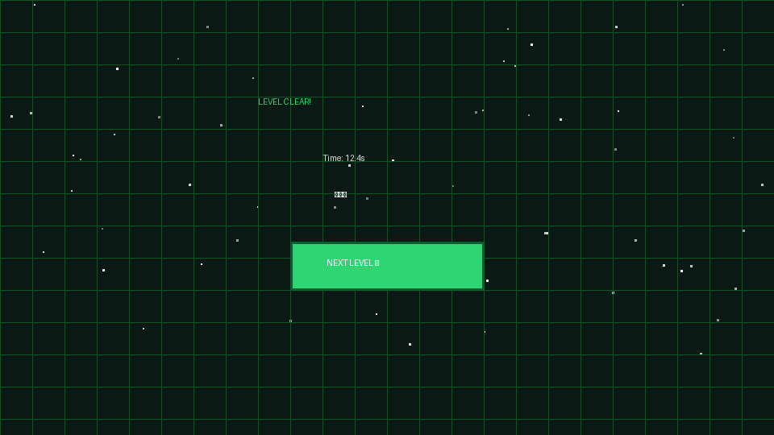

# Task 06: UI Overlays, HUD & Game State Screens

## 🎯 Task Objective
Create an atmospheric arcade UI overlay with retro typography, start screen, real-time HUD (Level, Deaths, Timer), death screen with shake effects, and stage victory screens.

---

## 💻 Implemented Code Snippet

```javascript
const screens = {
  start:         document.getElementById("start-screen"),
  death:         document.getElementById("death-screen"),
  levelComplete: document.getElementById("level-complete"),
  gameComplete:  document.getElementById("game-complete"),
};

function showScreen(name) {
  Object.values(screens).forEach(s => s?.classList.add("hidden"));
  if (name && screens[name]) screens[name].classList.remove("hidden");
}

function updateHUD() {
  document.getElementById("level-num").textContent = currentLevel + 1;
  document.getElementById("death-count").textContent = deaths;
  document.getElementById("timer-val").textContent = levelTimer.toFixed(1);
}
```

---

## 🖼️ Actual Output Screenshots

### Death Screen & Retry Menu


### Level Clear & Star Rating Screen

