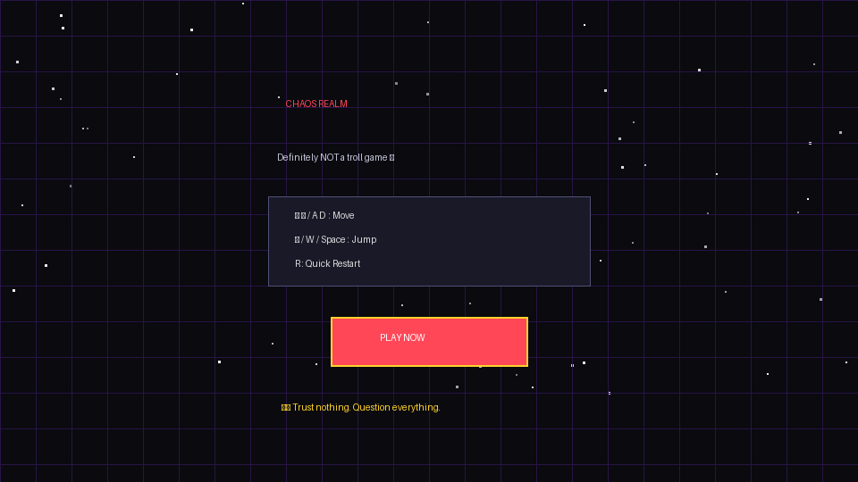
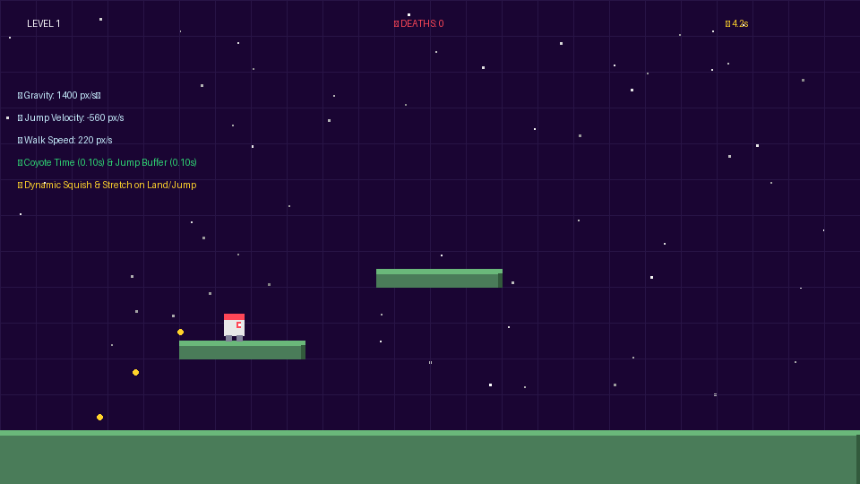
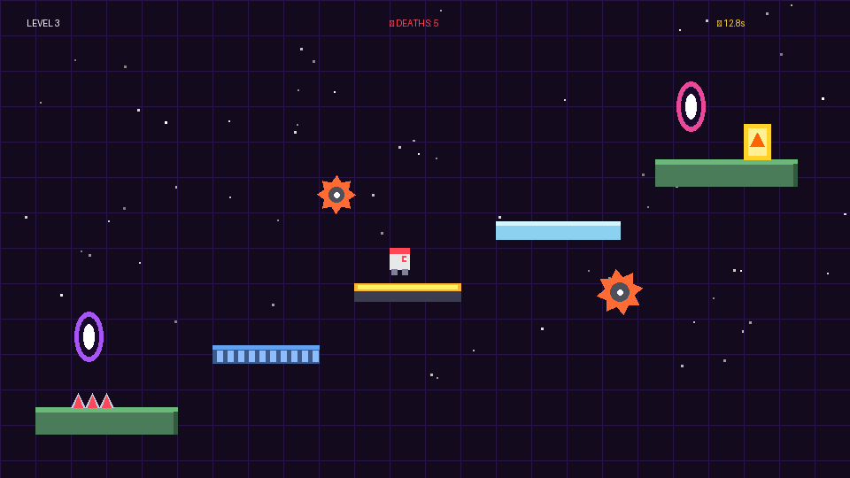
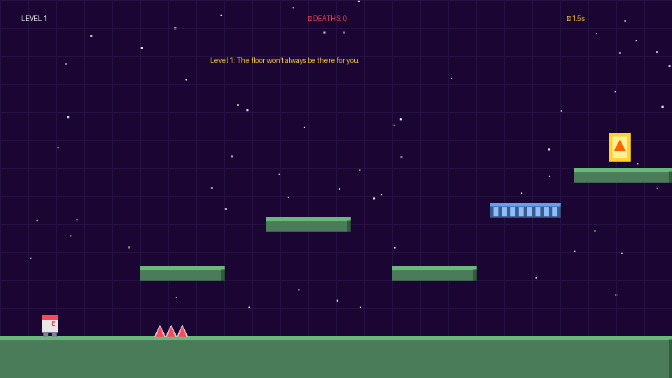
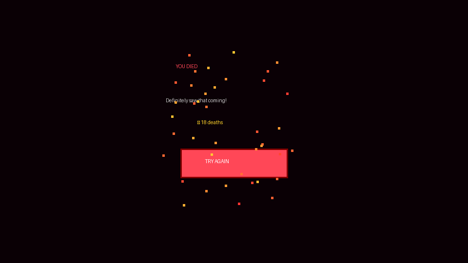

# 📁 Chaos Realm: Development Tasks, Process & Output Gallery

This directory contains complete step-by-step documentation of all development tasks completed from start to finish, along with actual code snippets, technical breakdowns, and rendered output screenshots.

---

## 📑 Tasks Index

| # | Document | Scope & Objective | Output Screenshot |
|---|---|---|---|
| 01 | [Task 01: Core Game Engine](01_TASK_GAME_ENGINE_AND_RENDER_LOOP.md) | Canvas 60 FPS loop, virtual resolution, state machine |  |
| 02 | [Task 02: Player Physics & Animation](02_TASK_PLAYER_PHYSICS_AND_ANIMATION.md) | Coyote time, jump buffering, velocity physics, squish |  |
| 03 | [Task 03: Synthesized Web Audio](03_TASK_SYNTHESIZED_WEB_AUDIO.md) | Zero-dependency Web Audio API oscillator synthesis | Embedded Code & Audio Map |
| 04 | [Task 04: Traps & Hazard Systems](04_TASK_TRAP_LOGIC_AND_HAZARD_SYSTEMS.md) | Saws, spikes, vanishing blocks, trampolines, portals |  |
| 05 | [Task 05: 10 Progressive Levels](05_TASK_LEVEL_DESIGNS_1_TO_10.md) | Full scripts and blueprints for all 10 challenge stages |  |
| 06 | [Task 06: UI Screens & Overlays](06_TASK_UI_SCREENS_AND_STATE_OVERLAYS.md) | Retro HUD, Start Screen, Death Screen, Level Clear |  |
| 07 | [Task 07: Git & Deployment](07_TASK_VERSION_CONTROL_AND_DEPLOYMENT.md) | Git setup, authentication, and GitHub Pages host | Live Repo & Link |
| 08 | [Task 08: Future Tasks Roadmap](08_FUTURE_TASKS_ROADMAP.md) | Upcoming features: Boss fights, level editor, sound | Roadmap Table |
